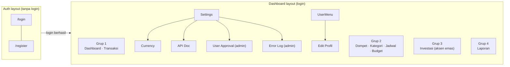
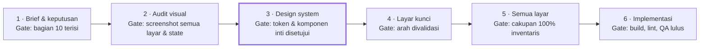

# TosmFi — Redesign Brief

> **Tanggal:** 5 Oktober 2026 · **Status:** draft, menunggu jawaban di [bagian 10](#10-arah-desain-yang-diinginkan)
> **Scope:** frontend `tosm-fi-fe` saja. Backend `tosm-fi-be` tidak berubah.

## Daftar isi

1. [Ringkasan](#1-ringkasan)
2. [Batasan tetap](#2-batasan-tetap)
3. [Profil produk dan pengguna](#3-profil-produk-dan-pengguna)
4. [Audit: shell, halaman, flow, dan modal](#4-audit-shell-halaman-flow-dan-modal)
5. [Audit: inventaris komponen](#5-audit-inventaris-komponen)
6. [Audit: design system saat ini](#6-audit-design-system-saat-ini)
7. [Audit: struktur folder dan konvensi kode](#7-audit-struktur-folder-dan-konvensi-kode)
8. [Kebutuhan teknis yang wajib didukung](#8-kebutuhan-teknis-yang-wajib-didukung)
9. [Temuan dan masalah UI saat ini](#9-temuan-dan-masalah-ui-saat-ini)
10. [Arah desain yang diinginkan](#10-arah-desain-yang-diinginkan) ← **perlu kamu isi**
11. [Deliverables, tahapan, dan kriteria sukses](#11-deliverables-tahapan-dan-kriteria-sukses)
12. [Lampiran](#12-lampiran)

---

## 1. Ringkasan

Redesign TosmFi hanya mengganti **lapisan tampilan**. API, flow, routes, Redux, dan logika tetap sama persis. Desain baru harus mencakup setiap halaman, modal, dan state yang ada hari ini, dalam light/dark dan tiga bahasa.

- **Produk:** TosmFi, aplikasi pencatat keuangan pribadi (web + PWA) untuk dompet, transaksi, kategori, budget, jadwal, laporan, dan investasi.
- **Stack:** React 19, TypeScript 6, Vite 8, Tailwind CSS v4 (dikonfigurasi di CSS), Redux Toolkit 2 + redux-persist, React Router 7, Recharts 3, i18next, react-icons (Heroicons v2). Package manager: **yarn**.
- **Skala UI saat ini:** 16 halaman, 25 dialog, ±9 popover/dropdown, 40 komponen generik, 75 komponen fitur, 597 string per bahasa.
- **Kenapa redesign:** belum ditulis. Isi di [bagian 10](#10-arah-desain-yang-diinginkan).
- **Hasil yang diharapkan:** satu design system baru (token + komponen) dan desain semua layar yang bisa diimplementasikan tanpa menyentuh logika.

**Cara memakai brief ini.** Bagian 2–9 berisi fakta dari audit kode, yaitu hal-hal yang **wajib didukung** desain baru. Bagian 10 berisi keputusan desain yang perlu kamu isi. Bagian 11 berisi tahapan kerja dan checklist serah terima.

---

## 2. Batasan tetap

Semua yang mengambil, menyimpan, atau menghitung data **tidak boleh diubah**. Aturan praktisnya: kalau sebuah perubahan butuh endpoint baru, field baru, atau urutan langkah baru, itu di luar scope redesign.

| Lapisan | Lokasi | Status | Catatan |
| --- | --- | --- | --- |
| Service & HTTP | `src/services/*` (15 file) | ❌ Jangan diubah | Kontrak API ke `tosm-fi-be`, interceptor token, auto-logout saat 401 |
| State | `src/redux/*` (12 slice), `store.ts` | ❌ Jangan diubah | Termasuk whitelist persist dan transform reset status |
| Hooks | `src/hooks/use-*.ts` (29 hook) | ❌ Jangan diubah | Komponen selalu lewat hook, tidak pernah memanggil service langsung |
| Tipe | `src/types/*` (16 file) | ❌ Jangan diubah | Bentuk data dari backend |
| Utilitas logika | `src/utils/*` | ❌ Jangan diubah | Pengecualian: `cn.ts` (helper class) dan warna di `report-export-pdf.ts` |
| Bootstrap | `main.tsx`, `helpers/i18n.ts`, `helpers/global-error-logging.ts`, logika `AppRouter` & `ProtectedRoute`, tsconfig, alias `@/` | ❌ Jangan diubah | Urutan import di `main.tsx` penting |
| Konstanta data | `routes.ts`, `storage-keys.ts`, `api-docs.ts`, `currencies.ts`, `decimal-options.ts`, `mock-*.ts` | ❌ Jangan diubah | |
| Navigasi | `constants/nav.ts`, `settings-menu.ts` | ⚠️ Struktur tetap | Path, `labelKey`, dan grup tetap. Ikon boleh diganti |
| Data visual tersimpan | `wallet-colors.ts`, `category-icons.ts`, `languages.ts` | ⚠️ Hati-hati | Warna hex dan **key** ikon tersimpan di database. Komponen ikon dan preset warna boleh diganti, key tidak boleh |
| Token & style global | `src/css/index.css` | ✅ Redesign | Nilai token bebas. **Pertahankan nama `primary-*` dan `ink-*`** (dipakai di mana-mana) dan `@custom-variant dark` |
| Komponen generik | `src/components/{atoms,molecules,organisms,templates}` | ✅ Redesign | Pertahankan nama export dan API props, atau ubah semua pemanggilnya |
| Komponen fitur | `src/layouts/<fitur>/*` | ✅ Redesign | Hanya JSX dan className di dalam `return`. Banyak file berisi logika, lihat [lampiran A](#a-file-view-yang-berisi-logika) |
| Halaman | `src/app/pages/*Page` | ✅ Redesign tipis | Hanya JSX/className. Logika infinite scroll, reorder, dan filter tetap |
| Markup visual di file logika | Fallback `ErrorBoundary`, `RouteFallback` di AppRouter, spinner `AppShell` di `App.tsx`, container toast di `use-toast.tsx` | ✅ Boleh | Hanya bagian markup/className |
| Aset & PWA | `src/assets/**`, `public/*`, meta di `index.html`, blok `manifest` di `vite.config.ts` | ✅ Boleh | |
| Teks UI | `src/helpers/lang/{id,en,jp}.json` | ➕ Boleh ditambah | Key baru wajib ada di ketiga file pada posisi yang sama. Jangan rename atau hapus key lama (±22 key dibentuk dinamis) |

### Kontrak yang wajib dipertahankan di view

- **Navigation state antar halaman.** Bentuk elemennya boleh berubah, state yang dikirim harus tetap:
  - Search di Topbar → `/transactions` dengan `{ focusSearch: true }`
  - MonthlySummaryCard → `/transactions` dengan `{ typeFilter }`
  - ExpenseByCategoryChart → `/transactions` dengan `{ typeFilter, categoryFilter, subCategoryFilter }`
  - BudgetsSummary → `/budgets` dengan `{ viewingBudgetId }`
- **Infinite scroll.** Elemen sentinel `<div ref>` di bawah daftar (Dashboard, Transaksi, Investasi) harus tetap ada.
- **Form.** Field, urutan langkah, dan validasi tetap. Layout, kontrol input, dan gaya tampilannya bebas.
- **Warna tersimpan.** Palet baru harus tetap menampilkan warna hex lama milik dompet, kategori, instrumen, dan budget dengan baik di light maupun dark.
- **Ikon kategori.** Disimpan di database sebagai nama komponen (mis. `"HiOutlineTag"`), dari campuran `react-icons/hi2`, `md`, dan `io5` (78 pilihan). Kalau set ikon diganti, setiap nama lama butuh padanan.
- **Bentuk navigasi.** Sidebar, bottom nav, atau tab bebas dipilih, asal semua tujuan menu tetap bisa dicapai.

---

## 3. Profil produk dan pengguna

TosmFi adalah aplikasi keuangan pribadi untuk **kelompok tertutup**. Pengguna mendaftar sendiri, tapi baru bisa login setelah di-approve admin. Hanya ada dua peran, `admin` dan `user`, dan bedanya cuma dua halaman admin di Settings.

| Modul | Fungsi untuk pengguna | Sumber data |
| --- | --- | --- |
| Dashboard | Net worth, alokasi aset, budget yang di-pin, skor kesehatan finansial, pengeluaran per kategori, transaksi terbaru | Backend |
| Transaksi | Pengeluaran, pemasukan, transfer antar dompet, koreksi saldo. Filter, kalender bulanan, pencarian | Backend |
| Dompet | Dompet berwarna, satu dompet utama, urutan bisa diatur | Backend |
| Kategori | Kategori pemasukan dan pengeluaran dengan subkategori, ikon, dan warna | Backend |
| Jadwal | Transaksi berulang harian, mingguan, bulanan, tahunan. Dibayar atau dibatalkan per jatuh tempo | Backend |
| Budget | Limit bulanan per budget, per kategori, dan per subkategori. Bisa di-pin ke Dashboard | Backend |
| Investasi | Instrumen, akun per instrumen, uang masuk dan keluar, transfer antar akun, profit/loss, grafik nilai | Backend |
| Laporan | Ringkasan per periode, cash flow, tren 12 bulan, top spending, pemakaian dompet, ekspor PDF/Excel/CSV | Backend (file ekspor dibuat di browser) |
| Settings | Mata uang (IDR, USD, JPY), jumlah desimal, profil dan password, reset data, alat admin | Mata uang dan desimal masih mock (localStorage) |

**Platform dan konteks pemakaian**

- **Web responsif + PWA** (mode standalone, bisa dipasang di HP). Breakpoint utama di 1024px: sidebar tetap di atasnya, drawer di bawahnya.
- **Bahasa:** Indonesia (default), Inggris, Jepang. Dipilih per pengguna dan diingat.
- **Tema:** light dan dark. Defaultnya mengikuti OS, bisa diganti manual lewat toggle.
- **Mata uang:** IDR, USD, JPY dengan 0, 1, atau 2 desimal. Format angka mengikuti mata uang, bukan bahasa UI.
- **Privasi:** nominal net worth bisa disamarkan ("••••••••") dengan ikon mata, penting kalau aplikasi dibuka di tempat umum.
- **Belum diketahui:** perangkat yang paling sering dipakai. Ini memengaruhi navigasi dan kepadatan layout, jadi jawab pertanyaan 12 di bagian 10.

---

## 4. Audit: shell, halaman, flow, dan modal

Ada **16 halaman, 25 dialog, ±9 popover, dan 13 flow utama** yang semuanya harus punya padanan di desain baru.

### 4.1 Peta navigasi



### 4.2 Shell aplikasi

| Elemen | Perilaku saat ini |
| --- | --- |
| Sidebar (≥ 1024px) | Tetap di kiri, lebar 288px. Isi: logo, 4 grup menu dalam card berbingkai, Settings, pemilih bahasa (accordion bendera). Investasi punya efek gold shimmer + sparkle |
| Drawer (< 1024px) | Sidebar yang sama muncul dari kiri (288px atau 85vw) lewat hamburger, dengan overlay gelap. Tertutup lewat overlay, ESC, atau pindah halaman. Di bawah 640px, UserMenu pindah ke dasar drawer |
| Topbar | Sticky, putih/80 + blur. Isi: hamburger + logo (< 1024px), toggle tema, ikon search (ke Transaksi), UserMenu (≥ 640px) |
| Konten | `<main>` adalah container scroll (window tidak scroll). Max 1200px, padding 16/24px, footer copyright di dalam area scroll |
| FAB "+" | 56px, kanan bawah, **hanya di Dashboard dan Transaksi** |
| Sub-halaman | Link teks "← Kembali" di atas. Tidak ada breadcrumb dan tidak ada bottom nav |
| Auth layout | Split screen: form di kiri, panel gradient hijau berisi kutipan di kanan (≥ 1024px). Logo + toggle tema di atas, pill bahasa di bawah form |
| Loading global | Spinner layar penuh saat cek sesi dan saat halaman di-lazy-load |
| Layar error | "Oops, something went wrong" dengan tombol Try Again dan Reload |
| Toast | Tengah bawah, bertumpuk, 2,5 detik, varian success/error/info, bunyi beep 880 Hz, tanpa tombol tutup |
| Confirm dialog | Lingkaran ikon, judul, deskripsi, Batal + Konfirmasi (atau tombol merah untuk aksi destruktif). Dipakai untuk 15 aksi |

### 4.3 Halaman

Pola state yang dipakai di banyak halaman: **loading** berupa overlay putih/60 + blur dengan spinner per card, **empty** berupa kotak bergaris putus-putus dengan pesan. Satu-satunya skeleton ada di 4 kartu ringkasan Laporan.

| Halaman | Path | Blok utama (urutan tampil) | Modal / overlay | Catatan state |
| --- | --- | --- | --- | --- |
| Login | `/login` | Username, password (show/hide), banner error, "Ingat saya", "Lupa password?", tombol Masuk, link Daftar, pill bahasa | – | Banner juga dipakai untuk "sesi berakhir" dan "menunggu validasi" |
| Register | `/register` | Nama lengkap, username, password, banner error, tombol Daftar, link Login | – | Sukses → toast → `/login` |
| Dashboard | `/dashboard` | Sapaan sesuai waktu; kartu net worth (gradient emerald + ilustrasi, bisa disamarkan) + 2 tile (Uangmu, Investasimu); donut alokasi aset (disembunyikan < 640px); budget yang di-pin; ringkasan bulanan; skor kesehatan finansial (gauge 0–100 + 3 checklist); donut pengeluaran per kategori; strip dompet; transaksi terbaru per hari | AddTransaction, BalanceCorrection, PayOccurrence, konfirmasi batal jadwal | Empty per card, overlay loading per card, infinite scroll 10/halaman. Dua kolom hanya ≥ 1280px |
| Transaksi | `/transactions` | Chip filter (dompet, tipe, kategori, subkategori); toolbar (search, rentang tanggal, sort, "bulan ini"); tab bulan (24 mundur, 12 maju); bar ringkasan (keluar, masuk, net); kalender bulan (titik warna + net per hari) + daftar transaksi | AddTransaction (edit), BalanceCorrection, PayOccurrence, popover rentang tanggal, dropdown sort | Pesan empty berbeda saat filter aktif, infinite scroll 20/halaman |
| Dompet | `/wallet` | Header (jumlah dompet, total saldo, reorder, toggle grid/list); kartu dompet (border kiri berwarna, badge Utama, saldo); kartu "+" | WalletForm (color picker + color wheel + input hex) | Mode reorder drag & drop. **Belum ada** empty dan loading state |
| Kategori | `/categories` | Header (jumlah kategori · subkategori, reorder, Tambah); kartu kategori (ikon berwarna, badge PEMASUKAN/PENGELUARAN, jumlah transaksi, hapus) + baris pill subkategori | CategoryForm, SubCategoryForm, CategoryIconPicker | Mode reorder. Ada empty, **belum ada** loading |
| Jadwal | `/schedule` | Judul + subjudul; daftar jadwal (ikon, judul, badge Dijeda, frekuensi, nominal, tombol jeda/edit/hapus) | AddSchedule (+ date picker), PayOccurrence (dari Dashboard/Transaksi) | Spinner, teks kosong. Jatuh tempo tampil di Dashboard & Transaksi |
| Budget | `/budgets` | **Daftar:** grid kartu budget berlatar warna budget (progress bar dengan penanda "Hari ini", persentase, pacing harian); kartu "+". **Detail** (route yang sama): header berwarna, donut breakdown, daftar kategori + limit + subkategori | BudgetForm, SelectCategories, SetLimit (keypad) | Mode reorder. **Belum ada** empty dan loading |
| Investasi | `/investment` | Header (Transfer, Tambah Instrumen); chip filter instrumen; area chart nilai total (granularitas + periode); kartu instrumen carousel/grid + sort; panel detail (chart riwayat, 3 tile statistik, kartu akun); toolbar + daftar transaksi investasi | InstrumentForm, InvestmentAccountForm, Withdrawal, Transfer, ProfitLoss, EditInvestmentTransaction, SelectInstrument, SelectInvestmentAccount, DateTimePicker | Aksen emas `#FFD166`. Spinner, empty "belum ada instrumen", infinite scroll 20 |
| Laporan | `/reports` | Filter periode (bulan-bulan lalu, Hari ini, Minggu ini, Bulan ini, Tahun ini, Rentang custom); menu Ekspor (PDF, Excel, CSV); 4 kartu ringkasan (± % vs periode lalu); cash flow chart; tren 12 bulan; breakdown kategori; top spending (trofi emas/perak/perunggu); pemakaian dompet | Popover rentang tanggal, dropdown ekspor | Satu-satunya skeleton di app. Empty di cash flow |
| Edit Profil | `/profile` | Card "Informasi Akun" (nama, username); card "Ganti Password" (3 field + catatan akan logout) | Konfirmasi simpan | Ganti password sukses → `/login` |
| Settings | `/settings` | Menu (User Requests\*, Error Log\*, Backend API, Currency); card Danger Zone (Reset Data) | Konfirmasi reset | \*khusus admin. Tema & bahasa **tidak** ada di sini |
| Currency | `/settings/currency` | Daftar mata uang (IDR, USD, JPY) + pilihan desimal 0/1/2 dengan preview | – | Masih mock |
| API Doc | `/settings/api-doc` | Grup endpoint; card accordion (badge method berwarna, path monospace, copy, payload, contoh JSON) | – | Halaman developer |
| User Approval | `/settings/user-approval` | Daftar user: nama, `@username · terdaftar {tanggal}`, badge Aktif atau tombol Aktifkan | – | Admin. Spinner, empty |
| Error Log | `/settings/error-log` | Search, chip environment; baris error (badge Baru, badge env, pesan merah, meta, stack trace di kotak kode, hapus) | Konfirmasi hapus | Admin. Empty berbeda saat filter aktif |

### 4.4 Flow utama

1. **Daftar → menunggu approval → login.** Register → toast → `/login` → login ditolak dengan banner "menunggu validasi" → admin mengaktifkan → login → Dashboard. Belum ada layar khusus "menunggu approval".
2. **Tambah transaksi (FAB).** Pilih tipe (Pengeluaran, Pemasukan, Transfer) → kategori → subkategori (bisa buat baru inline) atau chip cepat → nominal lewat kalkulator → judul dan catatan (opsional) → tanggal & jam → dompet → opsional "Catat sebagai Investasi" → simpan → toast. Edit lewat tap baris, dengan tambahan Duplikat dan Hapus.
3. **Koreksi saldo.** Tap dompet utama di Dashboard → kalkulator berisi saldo sekarang → simpan selisih sebagai koreksi.
4. **Budget.** Kartu "+" → nama, scope (semua/kategori tertentu), limit, warna → buka detail → atur limit per kategori lewat keypad → pin ke Dashboard.
5. **Transaksi terjadwal.** Jadwal → Tambah → isi → muncul sebagai baris "Terjadwal" di Dashboard & Transaksi → Bayar (PayOccurrence) atau Batalkan.
6. **Investasi.** Tambah instrumen → tambah akun → uang masuk lewat "Catat sebagai Investasi" di AddTransaction → tarik dana (opsional masuk ke dompet), transfer antar akun, catat profit/loss → edit atau hapus entri.
7. **Ekspor laporan.** Pilih periode → Ekspor → PDF/Excel/CSV → file terunduh + toast.
8. **Tema & bahasa.** Toggle tema di Topbar/halaman auth. Bahasa di Sidebar (drawer di HP) atau pill di halaman auth. Mata uang & desimal di Settings → Currency.
9. **Edit profil & ganti password.** UserMenu → Edit Profil.
10. **Reset data.** Settings → Reset Data → konfirmasi → toast.
11. **Approve user (admin).** Settings → User Requests → Aktifkan.
12. **Error log (admin).** Settings → Error Log → cari/filter → baca stack trace → hapus.
13. **Logout.** UserMenu → Logout → konfirmasi → `/login`.

### 4.5 Inventaris dialog dan overlay

| Fitur | Dialog (ukuran Modal saat ini) |
| --- | --- |
| Transaksi | AddTransaction (2xl), AmountCalculator (lg), DateTimePicker (md), SelectCategory (lg), SelectSubCategory (lg) |
| Dompet | WalletForm (sm), BalanceCorrection (lg) |
| Kategori | CategoryForm, SubCategoryForm, CategoryIconPicker (sm) |
| Jadwal | AddSchedule (2xl) + date picker (md), PayOccurrence (2xl) |
| Budget | BudgetForm (sm), SelectCategories (lg), SetLimit (sm) |
| Investasi | InstrumentForm, InvestmentAccountForm, Withdrawal, Transfer, ProfitLoss, EditInvestmentTransaction (sm); SelectInstrument, SelectInvestmentAccount (lg) |
| Global | AlertDialog (15 konfirmasi), toast, drawer mobile, layar error |
| Popover & dropdown | UserMenu, LanguageMenuButton, LanguageSwitcher, sort transaksi, rentang tanggal transaksi, rentang tanggal laporan, menu ekspor, sort instrumen, panel warna custom |

**Hal yang perlu diperhatikan desainer:**

- Modal bisa **bertumpuk sampai 4 lapis**: AddTransaction → SelectCategory → CategoryForm → CategoryIconPicker.
- Di HP, modal tetap berupa dialog di tengah layar. Belum ada bottom sheet.
- Pola yang berulang dan layak disatukan jadi satu komponen: kartu kategori + nominal (AddTransaction, AddSchedule, PayOccurrence), picker chip dompet (4 file), mode reorder (Dompet, Kategori, Budget), grid picker tile 56px, kartu "+" bergaris putus-putus, kotak empty, overlay loading.

---

## 5. Audit: inventaris komponen

Ada 40 komponen generik dan 75 komponen fitur. `Words` sudah dipakai dengan sangat baik (467 kali, tanpa `<p>` atau `<h*>` mentah). Sebaliknya, `Button` sering dilewati: ada **184 `<button>` mentah** dibanding 51 `<Button>`. Beberapa primitif penting juga belum ada dan disalin ulang di puluhan file, jadi redesign adalah momen yang tepat untuk melengkapinya.

### 5.1 Atoms (16)

| Komponen | Fungsi | Varian / props | Dipakai di |
| --- | --- | --- | --- |
| `Words` | Primitif teks | `type="<ukuran>/<berat>"`, `as` | 102 file |
| `Button` | Tombol utama | `variant`: primary, secondary, ghost, danger; `isLoading`. **Tidak ada prop size** | 32 file |
| `Input` | Field teks dengan wrapper berbingkai | `startIcon`, `endSlot`, `hasError` | 19 file |
| `Tooltip` | Bubble portal yang pindah sisi otomatis | `side` (top/bottom) | 40 file |
| `IconLoader` | Spinner SVG 8 jari | props SVG | 32 file |
| `ModalCloseButton` | Tombol X di modal | `onClose` | 22 file |
| `Icons` | 16 ikon SVG custom (stroke 1.75) | Sun, Moon, User, Lock, Eye, Search, dll. | 6 file |
| `Checkbox` | Checkbox native (`accent-primary-600`) | – | 4 file |
| `Logo` | Kotak gradient + teks "Tosm Finance" | – | 3 file |
| `ThemeToggle` | Switch pill matahari/bulan | – | 2 file |
| `AnimatedHeight` | Transisi tinggi dengan ResizeObserver | – | 1 file |
| `ColorWheel` | Ring hue + kotak saturasi | `value`, `onChange` | 1 file |
| `CopyButton` | Salin ke clipboard + toast | `value` | 1 file |
| `MethodBadge` | Badge HTTP method (GET hijau, POST biru, PUT/PATCH amber, DELETE merah) | `method` | 1 file |
| `GoldShimmerEffect` | Overlay kilau emas (keyframe-nya kosong, jadi tidak beranimasi) | – | 1 file |
| `SparkleEffect` | 5 bintang emas berkedip | – | 1 file |

### 5.2 Molecules (18)

| Komponen | Fungsi | Dipakai di |
| --- | --- | --- |
| `Modal` | Shell dialog: portal, backdrop blur, stack ESC. `size` sm–3xl. Setiap modal membuat header sendiri (tidak ada ModalHeader/Footer) | 24 file |
| `FormField` | Label + field + pesan error | 11 file |
| `AlertDialog` | Dialog konfirmasi (confirm, success, error, info, destructive) | lewat `useConfirmDialog` |
| `Toast` | Notifikasi success, error, info | lewat `useToast` |
| `PasswordInput` | Input + ikon gembok + show/hide | 3 file |
| `ColorPicker` (+ `CustomColorPanel`) | Preset swatch + panel custom (color wheel + input hex) | 4 file |
| `DonutChart` | Donut Recharts dengan label tengah dan slice yang bisa diklik | 3 file |
| `CategoryBreakdownChart` | Donut + daftar kategori/subkategori yang bisa dibuka | 2 file |
| `TransactionRow`, `TransferRow`, `ScheduledTransactionRow` | Baris daftar transaksi | 1 file masing-masing |
| `AmountCalculatorKeypad` | Keypad kalkulator 4 kolom | 3 file |
| `BudgetProgressBar` | Progress bulan dengan penanda "Hari ini" | 2 file |
| `NavLink` | Item sidebar (aktif = gradient primary; Investasi + efek emas) | 1 file |
| `LanguageMenuButton` | Dropdown pill bahasa (membuka ke atas) | 2 file |
| `Footer` | Baris copyright | 2 file |
| `Pagination`, `UnderConstruction` | **Tidak terpakai** | 0 |

### 5.3 Organisms (4) dan templates (2)

| Komponen | Fungsi |
| --- | --- |
| `Sidebar` | Varian desktop dan drawer, lebar 288px, grup menu dalam card berbingkai `rounded-2xl` |
| `Topbar` | Bar atas blur: menu, toggle tema, search, UserMenu |
| `UserMenu` | Avatar inisial dengan lingkaran gradient + dropdown (Edit Profil, Logout) |
| `LanguageSwitcher` | Accordion bahasa di dalam sidebar |
| `DashboardLayout` | Shell 14 halaman login. Latar `ink-50`/`ink-950`, konten `max-w-[1200px]` |
| `AuthLayout` | Shell Login & Register. Dua kolom ≥ 1024px, form `max-w-sm` |

### 5.4 Komponen fitur (`src/layouts/`, 75)

| Fitur | Jumlah | Komponen |
| --- | --- | --- |
| dashboard | 9 | AddTransactionFab, AssetAllocationCard, BudgetsSummary, ExpenseByCategoryChart, FinanceOverview, FinancialHealthCard, MonthlySummaryCard, TransactionList, WalletQuickSwitcher |
| transaction | 11 | AddTransactionModal, AmountCalculatorModal, DateRangeFilterPopover, DateTimePickerModal, MonthTabs, SelectCategoryModal, SelectSubCategoryModal, TransactionCalendar, TransactionFilterChips, TransactionSummaryBar, TransactionToolbar |
| wallet | 6 | AddWalletCard, BalanceCorrectionModal, ViewModeToggle, WalletCard, WalletFormModal, WalletReorderItem |
| category | 6 | CategoryCard, CategoryFormModal, CategoryIconPicker, CategoryReorderItem, SubCategoryFormModal, SubCategoryPill |
| schedule | 2 | AddScheduleModal, PayOccurrenceModal |
| budget | 7 | BudgetBreakdownList, BudgetCard, BudgetDetailView, BudgetFormModal, BudgetReorderItem, SelectCategoriesModal, SetLimitModal |
| investment | 21 | AddInstrumentCard, EditInvestmentTransactionModal, InstrumentCard, InstrumentDetailPanel, InstrumentFilterChips, InstrumentFormModal, InstrumentHistoryChart, InstrumentSortDropdown, InstrumentViewModeToggle, InvestmentAccountCard, InvestmentAccountFormModal, InvestmentAccountPickerButton, InvestmentTransactionList, InvestmentTransactionRow, InvestmentTransactionToolbar, NetWorthChart, ProfitLossFormModal, SelectInstrumentModal, SelectInvestmentAccountModal, TransferFormModal, WithdrawalFormModal |
| report | 8 | CashFlowChart, ExportSection (tidak dipakai), MonthlyTrendChart, ReportExportMenu, ReportPeriodFilter, ReportSummaryCards, TopSpendingList, WalletUsageCard |
| settings | 3 | ApiEndpointCard, CurrencyOptionList, DecimalOptionList |
| login, register | 2 | LoginForm, RegisterForm |

### 5.5 Primitif yang belum ada tapi disalin berulang kali

Ini kandidat komponen baru di design system. Membuatnya sekali akan menghapus ratusan salinan class dan otomatis menyeragamkan tampilan.

| Primitif usulan | Salinan saat ini | Catatan |
| --- | --- | --- |
| `IconButton` | ±75 salinan dalam 11 kombinasi ukuran/radius | Paling umum `h-9 w-9 rounded-full`, `h-8 w-8 rounded-full`, `h-8 w-8 rounded-md`. Gaya hapus merah ditulis ulang 11 kali |
| `Card` | String `rounded-2xl border border-ink-200 bg-white` muncul 25× di 23 file | Padding p-4 atau p-5, judul base/bold atau sm/bold |
| `EmptyState` | Kotak putus-putus di 25 file | Padding bervariasi `py-6/8/10/16` |
| `LoadingOverlay` / `Skeleton` | Overlay `bg-white/60 backdrop-blur` + spinner, 16 salinan | Skeleton hanya di Laporan |
| `Badge` / `Pill` | 14 salinan `rounded-full bg-ink-100` dengan 5 varian padding | |
| `SegmentedControl` | 3 gaya berbeda | Lihat [9.1](#91-konsistensi-visual) |
| `Switch` | 3 salinan (ThemeToggle, dua ViewModeToggle) | Dua ViewModeToggle hampir identik |
| `Dropdown` / `Popover` | 7 implementasi klik-di-luar terpisah | Radius `rounded-xl` vs `rounded-2xl` |
| `Textarea` | 3 `<textarea>` mentah identik | AddTransaction, AddSchedule, BalanceCorrection |
| `PageHeader` | 15 halaman menulis judul sendiri | |
| `ModalHeader` / `ModalFooter` | 25 modal membuat header dan tombol sendiri | |
| `EntityPill` (dompet/kategori) | Markup sama di 3 komponen baris | |
| `WalletChipPicker` | 4 file | |
| `ReorderList` | 3 implementasi paralel (Dompet, Kategori, Budget) | |
| `SelectGridModal` | 5 modal Select\* paralel | Tile 56px, 4–5 kolom |

### 5.6 Varian dan file yang tidak terpakai

- `Button` varian `ghost`, `Input` prop `hasError`, ukuran `Modal` `xl` dan `3xl`, `Words` ukuran `4xl` dan berat `light`.
- 7 dari 16 ikon custom: Mail, ArrowUpRight, ArrowDownRight, Bell, Plus, Menu, X.
- `Pagination`, `UnderConstruction`, `ExportSection`.

---

## 6. Audit: design system saat ini

Design system saat ini hanya punya **dua skala warna (`primary`, `ink`) dan satu font**. Radius, shadow, spacing, warna semantik, dan warna chart semuanya ditulis langsung di class atau hex. Akibatnya, makna yang sama (mis. "pengeluaran") muncul dalam beberapa nilai berbeda. Design system baru perlu menambahkan token untuk semua itu.

### 6.1 Warna

**Primary** (hijau → teal → navy, custom). Langkah 50, 100, dan 400 identik dengan emerald Tailwind.

| 50 | 100 | 200 | 300 | 400 | 500 | 600 | 700 | 800 | 900 | 950 |
| --- | --- | --- | --- | --- | --- | --- | --- | --- | --- | --- |
| `#ecfdf5` | `#d1fae5` | `#9dedcc` | `#68e0b2` | `#34d399` | **`#23ac82`** | `#12846b` | `#106c61` | `#0f5358` | `#0d3b4e` | `#092a3d` |

**Ink** sama persis dengan zinc Tailwind (`#fafafa` → `#09090b`).

**Frekuensi pemakaian:** ink 1.803, primary 315, red 168, white 159, amber 21, blue 8, purple 4, emerald 4, teal 2.

**Warna semantik belum seragam.** Ini yang paling perlu dirapikan lewat token:

| Makna | Nilai yang dipakai saat ini |
| --- | --- |
| Pemasukan / sukses | `primary-600`/`400` (teks), `#23ac82` (chart), `emerald-500` dan `#10B981` (skor kesehatan) |
| Pengeluaran / bahaya | `red-500` (baris), `red-600` (kartu ringkasan), `#ef4444` (chart), `#EF4444` (lewat limit) |
| Investasi | `amber-300/400/500/600`, `#F59E0B` (alokasi aset), emas `#FFD166` (chart net worth, efek nav) |
| Kas | Teal `#2DD4BF` |
| Net (laporan) | `blue` |
| Peringatan | `amber-500`, `#F59E0B` |
| Kartu net worth | Gradient `emerald-900 → emerald-950 → teal-950`, di luar palet primary |

**Warna milik pengguna.** Preset `WALLET_COLOR_PRESETS` (dipakai dompet, kategori, budget, instrumen): `#7CB87C` `#4F9E94` `#4FC3D9` `#4A90E2` `#3F51B5` `#7E57C2` `#A64AC9` `#E2574C` `#F0A343`. Pengguna juga bisa memilih warna custom apa pun lewat color wheel. Tint latar dibuat dengan menambah alpha hex ke warna pengguna, dengan 4 nilai berbeda untuk ide yang sama (`1A`, `26`, `33`, `40`).

**Chart.** Empat chart kartesius memakai set hex terpisah untuk light/dark, misalnya grid `#e4e4e7`/`#27272a`, tick `#a1a1aa`/`#71717a`, tooltip `#ffffff`/`#18181b`.

### 6.2 Tipografi

- **Font:** Plus Jakarta Sans variable 400–800, self-hosted. `font-mono` hanya 8 kali (API docs, input hex, simbol mata uang).
- **Skala `Words`** memakai px arbitrer, sehingga line-height bawaan Tailwind ikut hilang:

| Token | xxs | xs | sm | base | lg | xl | 2xl | 3xl | 4xl |
| --- | --- | --- | --- | --- | --- | --- | --- | --- | --- |
| Ukuran | 10px | 12px | 14px | 16px | 18px | 20px | 24px | 30px | 36px |
| Dipakai | 26× | 129× | 240× | 17× | 37× | 14× | 17× | 4× | 0 |

- **Berat:** hanya light, regular, bold, dan dalam praktiknya hampir semuanya bold (`sm/bold` saja 184×). Tidak ada medium/semibold.
- **Hierarki:** h1 halaman `2xl/bold`, h2 seksi `lg/bold`, judul card `base/bold`. Label seksi kecil memakai `uppercase tracking-wide`.
- **Belum ada:** kontrol line-height, `tabular-nums` untuk nominal uang, dan ukuran di luar skala (`text-[13px]` untuk link "Lihat semua", `text-[11px]` di blok kode).

### 6.3 Radius, shadow, border, spacing

| Aspek | Pemakaian saat ini |
| --- | --- |
| Radius | `rounded-full` 144 (pill, ikon), `rounded-2xl` 110 (card, modal, popover di layouts), `rounded-xl` 46 (Button, Input, Toast), `rounded-lg` 30, `rounded-md` 27 |
| Shadow | Desain datar dan berbasis border. Card tanpa shadow; `shadow-sm` untuk knob toggle, `shadow-lg` untuk popover/tooltip/toast/FAB, `shadow-xl` untuk modal dan drawer |
| Border | `border-ink-200` di light. Di dark tidak konsisten: `ink-800` (101×) vs `ink-700` (43×). `border-dashed` untuk kartu "+" dan empty state, `border-l-4` untuk aksen dompet |
| Gap | `gap-2` 139, `gap-3` 96, `gap-1` 76, `gap-1.5` 61, `gap-4` 50. Gap root halaman bervariasi 5, 6, atau 8 |
| Padding | Card p-5 atau p-4, modal p-6, pill `px-2 py-0.5` atau `px-3 py-1.5` |
| Lebar | Konten 1200px, modal `max-w-sm` s/d `2xl`, popover `w-44` s/d `w-72`, drawer `w-72` |
| z-index | 10, 20, 30, 40, 50, 60 (toast) |

### 6.4 Ikon

- **UI:** Heroicons v2 (`react-icons/hi2`) di 82 file, ±100 ikon, mayoritas outline. Solid dan outline tercampur untuk glyph yang sama (chevron, check).
- **Ikon custom** (`atoms/Icons`, 16 buah) memakai stroke 1.75, berbeda dari Heroicons (1.5), dan sebagian menduplikasi ikon Heroicons.
- **Ikon kategori** (`constants/category-icons.ts`): 78 pilihan dalam 7 grup (umum, makanan, transportasi, hobi, investasi, kesehatan, sosial). Campuran `hi2`, `md` (33 ikon), dan `io5` (1 ikon). **Disimpan di database sebagai nama komponen** (mis. `"HiOutlineTag"`), dengan fallback ke `HiOutlineTag`.
- **Ukuran:** `h-4` paling umum (113×), lalu `h-5`, `h-3.5`, `h-4.5`.

### 6.5 Chart (Recharts)

| Chart | Tipe | Lokasi |
| --- | --- | --- |
| `DonutChart` | Donut, warna per slice dari entitas, label tengah custom | Dashboard (kategori, alokasi aset), Laporan, Budget |
| `CashFlowChart` | Line, 2 seri (masuk/keluar), legend bisa diklik, titik hari ini | Laporan |
| `MonthlyTrendChart` | Bar 12 bulan, radius atas 6 | Laporan |
| `NetWorthChart` | Area dengan gradient emas | Investasi |
| `InstrumentHistoryChart` | Area (nilai sekarang) + garis abu (modal) | Investasi |
| Sparkline | Area kecil tanpa sumbu, opacity 60% | Kartu instrumen dan akun |
| Gauge skor | SVG custom (bukan Recharts) | Dashboard |
| Progress bar | Div dengan `transition-[width]` | Budget, pemakaian dompet |

Gaya chart (grid, tick, tooltip radius 12, legend lingkaran) disalin manual di keempat chart kartesius. Desain baru sebaiknya punya satu spec chart.

### 6.6 Animasi dan efek

- Tanpa library animasi. Kebanyakan `transition-colors` (157×), durasi paling umum 300ms.
- Spinner (`animate-spin`) di mana-mana, `animate-pulse` hanya untuk skeleton Laporan.
- Accordion dengan trik `grid-rows-[0fr] → [1fr]` (5 tempat), chevron berputar 180°.
- Slice donut "pop-out" dengan easing spring, animasi Recharts 500–600ms.
- `hover:scale-105` di swatch, `hover:scale-[1.01]` di kartu budget.
- Efek emas di menu Investasi: hanya sparkle yang jalan, shimmer dan glow kosong.

### 6.7 Dark mode

Sekitar 87% class warna sudah punya pasangan `dark:`. Pemetaan permukaan saat ini:

| Permukaan | Light | Dark |
| --- | --- | --- |
| Latar halaman | `ink-50` | `ink-950` |
| Card, input, modal | `white` | `ink-900` |
| Hover baris | `ink-50` atau `ink-100` | `ink-800` (kadang `ink-700`/`ink-900`) |
| Judul | `ink-900` | `ink-50` |
| Teks muted | `ink-400` | `ink-500` (di 60 tempat malah terbalik: `ink-500` → `ink-400`) |
| Border | `ink-200` | `ink-800` atau `ink-700` |

Area yang sengaja light-only karena berlatar warna dengan teks putih: kartu net worth, kartu dan detail budget, progress bar budget, panel gradient di halaman auth.

### 6.8 Aset

- **Logo:** `LogoMain.png` (1320×1008, 102 KB), ditampilkan di dalam kotak gradient 36px sehingga logonya sendiri hanya ±12px. Belum ada versi SVG.
- **Ilustrasi:** satu file, `net-worth.svg` (dompet teal + koin emas) di kartu net worth.
- **Font:** satu file woff2 variable.
- **Ikon PWA:** `favicon-32x32.png`, `apple-touch-icon.png` (180), `favicon-512x512.png` (sebenarnya 1024×1018, 780 KB).

---

## 7. Audit: struktur folder dan konvensi kode

Implementasi redesign harus mengikuti konvensi yang sudah ada supaya diff tetap bersih dan mudah direview.

### 7.1 Struktur `src/`

```
src/
├── main.tsx              # import CSS → i18n → error logging → render (urutan penting)
├── App.tsx               # Provider: Redux → PersistGate → Theme → Toast → ConfirmDialog → AppShell
├── app/
│   ├── AppRouter/        # semua route, lazy-load + retry, RouteFallback spinner
│   ├── ProtectedRoute/   # redirect ke /login kalau belum login
│   ├── ErrorBoundary/    # layar error saat crash render
│   └── pages/<Name>Page/ # 16 halaman, tipis
├── assets/               # fonts/ (Plus Jakarta Sans), images/ (logo, ilustrasi)
├── components/
│   ├── atoms/            # 16 primitif (Button, Words, Input, ...)
│   ├── molecules/        # 18 (Modal, FormField, TransactionRow, ...)
│   ├── organisms/        # 4 (Sidebar, Topbar, UserMenu, LanguageSwitcher)
│   └── templates/        # 2 (DashboardLayout, AuthLayout)
├── layouts/<fitur>/      # 75 komponen spesifik fitur (budget, category, dashboard, investment, ...)
├── constants/            # routes, nav, settings-menu, category-icons, wallet-colors, api-docs, ...
├── css/index.css         # satu-satunya stylesheet: @theme token, dark variant, font, keyframes
├── helpers/              # i18n.ts, global-error-logging.ts, lang/{id,en,jp}.json
├── hooks/                # 29 hook use-*.ts (lapisan logika)
├── redux/                # store, slices/<nama>Slice/
├── services/             # http-client.ts + 14 <entity>.service.ts
├── types/                # <entity>.types.ts
└── utils/                # cn, perhitungan, periode laporan, ekspor
```

### 7.2 Konvensi penamaan dan file

- **Komponen, layout, halaman:** folder PascalCase berisi `index.tsx`, selalu named export `export function Nama`. Tidak ada default export dan tidak ada barrel komponen. Sub-komponen kecil boleh di file yang sama.
- **Hooks:** kebab-case `use-x.ts` (`.tsx` kalau berisi provider atau JSX).
- **Services:** `x.service.ts`, export object `xService = { async fn() {} }`.
- **Utils, constants, helpers:** kebab-case `.ts`. Konstanta pakai `SCREAMING_SNAKE`.
- **Import:** selalu lewat alias `@/`.

### 7.3 Bentuk kode komponen

- **Props:** `interface XProps` di atas komponen, didestrukturisasi dengan default. Atom meng-extend atribut native (`ButtonHTMLAttributes`, `InputHTMLAttributes`) dan meneruskan `...rest`.
- **Varian:** map `Record<Variant, string>` (mis. `variantClass` di Button, `SIZE_CLASS` di Modal).
- **Class:** `cn()` dari `src/utils/cn.ts`. **Ini clsx biasa, tanpa tailwind-merge**, jadi class yang bertabrakan lewat `className` (mis. `px-2` vs `px-4` bawaan) tidak selalu menang.
- **Teks:** `const { t } = useTranslation()`, semua teks lewat `t()` dan dirender dengan `<Words type="<ukuran>/<berat>">`.
- **Halaman** hanya memanggil hook dan meneruskan data + callback ke layout. Semua halaman login dibungkus `<DashboardLayout>`.

Contoh pola komponen layout (`layouts/wallet/WalletCard`, disingkat):

```tsx
export function WalletCard({ wallet, onClick }: WalletCardProps) {
  const { t } = useTranslation();
  const { format } = useCurrency();
  return (
    <button type="button" onClick={onClick} style={{ borderLeftColor: wallet.color }}
      className="flex flex-col gap-1.5 rounded-2xl border border-l-4 border-ink-200 bg-white p-5 dark:border-ink-800 dark:bg-ink-900">
      <Words type="lg/bold" className="text-ink-900 dark:text-ink-50">{wallet.nameWallet}</Words>
      <Words type="xl/bold" className="text-ink-900 dark:text-ink-50">{format(wallet.balance)}</Words>
    </button>
  );
}
```

### 7.4 Aturan dari `CLAUDE.md` yang wajib diikuti

1. Semua teks untuk pengguna memakai `Words`, bukan `<p>`/`<span>`/`<h*>` mentah. Saat ini kepatuhannya sudah penuh.
2. Semua modal fitur membungkus `molecules/Modal` dan memakai `ModalCloseButton`. Konfirmasi lewat `useConfirmDialog`.
3. Semua string lewat `t()`. Key baru masuk ke **ketiga** file bahasa pada posisi yang sama.
4. Dark mode berbasis class: setiap class warna light dipasangkan dengan `dark:`. Jangan mengandalkan `prefers-color-scheme`.
5. Tailwind v4 dikonfigurasi hanya di `@theme` dalam CSS. Tidak ada `tailwind.config.js`.
6. Primitif generik ada di `components/*`, komposit fitur di `layouts/<fitur>/`, halaman tetap tipis.
7. Komponen tidak pernah memanggil service atau dispatch action langsung, selalu lewat hook.
8. Preferensi lokal (tema, view mode) tetap di luar Redux.
9. Input nominal memakai `use-amount-calculator` + `AmountCalculatorKeypad`. Route hanya dari konstanta `ROUTES`.
10. Jalankan `graphify update .` setelah mengubah kode.

### 7.5 Tooling

- **Perintah:** `yarn dev`, `yarn build` (`tsc -b && vite build`), `yarn lint`. Prettier terpasang (double quote, trailing comma, printWidth 100) tapi tidak ada script format.
- **TypeScript:** `strict` tidak aktif. `verbatimModuleSyntax` aktif, jadi wajib `import type`. Tidak boleh enum (`erasableSyntaxOnly`).
- **Tidak ada test.** Verifikasi redesign dilakukan lewat build, lint, dan QA visual manual.
- **Deploy:** Netlify (SPA rewrite). Env: `VITE_API_BASE_URL`.

---

## 8. Kebutuhan teknis yang wajib didukung

Setiap desain layar dan komponen harus lolos kebutuhan di bawah ini.

### 8.1 Tiga bahasa (id, en, jp)

- 597 string per bahasa dalam 22 namespace.
- **Bahasa Indonesia 1,4–2,4× lebih panjang** dari Inggris untuk label pendek: "Pengeluaran Berdasarkan Kategori", "Kebutuhan Sehari-hari", "Sembunyikan saldo". Desain pakai teks Indonesia sebagai kasus terpanjang.
- Kalimat terpanjang ±100–120 karakter (deskripsi reset data, layar error, konfirmasi hapus transaksi investasi).
- **Bahasa Jepang tidak memakai spasi**, sehingga pemenggalan dan truncation berperilaku berbeda.
- Pesan error dari backend selalu berbahasa Indonesia dan bisa panjang. Toast dan banner harus muat beberapa baris.
- Nominal bisa panjang: "IDR 1.234.567.890,00". Kartu saldo di layar 320–375px harus tetap muat.

### 8.2 Light dan dark

- Toggle manual (class `.dark` di `<html>`), default mengikuti OS. Keduanya **harus didesain lengkap**, bukan dark sebagai turunan otomatis.
- Chart (Recharts) membaca tema dan memakai set warna hex terpisah untuk light/dark. Palet chart baru harus menyediakan keduanya.
- Warna milik pengguna (dompet, kategori, instrumen, budget) harus terbaca di kedua tema, termasuk saat dipakai sebagai latar kartu budget dengan teks putih.

### 8.3 Responsif

- Tier breakpoint efektif: **< 640px, 640px, 1024px, 1280px**. Lebar minimum yang realistis 320px.
- Desain minimal di 3 lebar: **375px (HP)**, **768px (tablet)**, **1280px+ (desktop)**.
- `<main>` adalah container scroll, bukan window. Sticky element dan FAB mengacu ke sini.
- PWA standalone di iPhone butuh **safe-area inset** (notch, home indicator), terutama kalau memakai bottom nav atau bottom sheet.
- Drag & drop reorder saat ini memakai HTML5 `draggable`, yang kurang andal di layar sentuh. Desain mode reorder sebaiknya punya alternatif (mis. tombol naik/turun).

### 8.4 State yang wajib ada di desain

Setiap halaman, card data, daftar, dan chart butuh desain untuk:

| State | Saat ini | Kebutuhan desain baru |
| --- | --- | --- |
| Loading pertama | Overlay blur + spinner per card, skeleton hanya di Laporan | Satu pola konsisten (skeleton disarankan) |
| Memuat lagi (infinite scroll) | Spinner kecil di bawah daftar | Indikator di ujung daftar |
| Kosong | Kotak putus-putus + teks | Pesan + aksi utama (mis. "Tambah dompet pertama") |
| Kosong karena filter | Teks berbeda | Pesan + tombol reset filter |
| Error | Toast / banner merah | Pola error inline untuk card dan form |
| Disabled / submitting | Opacity 60% + spinner di tombol | Tetap, dengan spec jelas |
| Mode reorder | Tombol header berubah jadi Batal/Simpan Urutan | Tetap, dengan affordance drag yang jelas |
| Disamarkan (privasi) | "••••••••" | Tetap |

### 8.5 PWA

- Manifest: nama "TosmFi", `theme_color` dan `background_color` `#09090b`, display `standalone`.
- Desain baru butuh **aset ikon lengkap**: 192px, 512px, versi maskable, apple-touch-icon 180px, favicon 32px. File 512px saat ini sebenarnya 1024×1018px dan 780 KB.
- Tentukan warna `theme-color` light dan dark (saat ini belum ada meta `theme-color`).
- Splash/loading awal: saat ini spinner polos.

### 8.6 Aksesibilitas (target WCAG AA)

- Kontras teks minimal **4,5:1** (teks kecil) dan **3:1** (teks besar dan ikon penting), di light dan dark.
- Setiap komponen interaktif punya **focus state yang terlihat**.
- Target sentuh minimal **44×44px** di HP.
- Desain animasi menyediakan versi **reduced motion**.
- Ikon-tanpa-label tetap butuh tooltip (pola ini sudah konsisten dipakai).

---

## 9. Temuan dan masalah UI saat ini

Temuan ini adalah masalah yang bisa diselesaikan oleh redesign, ditambah beberapa catatan di luar scope supaya desainer tahu konteksnya.

### 9.1 Konsistensi visual

| # | Temuan | Contoh |
| --- | --- | --- |
| 1 | Warna semantik punya banyak nilai | Pengeluaran: `red-500`, `red-600`, `#ef4444`. Investasi: amber vs emas `#FFD166`. Sukses: primary vs `emerald-500` |
| 2 | Segmented control 3 gaya | Berbingkai `rounded-xl` (form modal), pill abu `rounded-full` (chart & filter laporan), switch pill (toggle tema & view mode) |
| 3 | Icon button 11 kombinasi | Aksi hapus/edit yang sama memakai `rounded-md` di satu tempat dan `rounded-full` di tempat lain |
| 4 | Radius popover berbeda | `rounded-2xl` di layouts, `rounded-xl` di components |
| 5 | Hover baris berbeda | `TransactionRow` memakai `ink-100`, `TransferRow` memakai `ink-50` |
| 6 | Border dark berbeda | `ink-800` dan `ink-700` dipakai bergantian |
| 7 | Lima gaya card | Card standar, aksen kiri (dompet), latar warna penuh (budget), border saat dipilih + sparkline (instrumen), gradient (net worth) |
| 8 | Tint warna entitas | 4 nilai alpha (`1A`, `26`, `33`, `40`) untuk tile ikon yang sama |
| 9 | Teks di luar skala | Link "Lihat semua" `13px`, blok kode `11px`, label tengah donut di luar `Words` |
| 10 | Hover sidebar di dark terbalik | Item tidak aktif `ink-800`, hover malah lebih gelap `ink-900` |
| 11 | Ikon tidak seragam | Ikon custom stroke 1.75 vs Heroicons 1.5; chevron dan check solid/outline tercampur |
| 12 | Tombol tanpa focus state | 184 `<button>` mentah tanpa `focus-visible`, 12 di antaranya memakai `outline-none` |
| 13 | Override class tidak andal | `cn()` tanpa tailwind-merge. Contoh: `SchedulePage` mengirim `px-3 py-1.5` ke Button yang sudah punya `px-4 py-2.5` |
| 14 | Hampir semua teks bold | `sm/bold` dipakai 184×, sehingga hierarki visual lemah |
| 15 | Logo terlalu kecil | Logo PNG ±12px di dalam kotak gradient 36px |

### 9.2 Aksesibilitas

| Pasangan warna | Rasio kontras | Dipakai | Teks kecil AA |
| --- | --- | --- | --- |
| `ink-400` di atas putih (teks sekunder) | 2,56 | 251× | ❌ |
| `ink-300` di atas putih (kebanyakan ikon) | 1,48 | 110× | ❌ |
| dark: `ink-500` di atas `ink-900` | 3,67 | 108× | ❌ |
| dark: `ink-600` di atas `ink-900` | 2,29 | – | ❌ |
| putih di atas `primary-600` (tombol) | 4,63 | – | ✅ |
| putih di atas `primary-500` (hover tombol) | 2,88 | – | ❌ |
| teks/tombol `red-500` | 3,81 | – | ❌ |

- Teks putih 60–70% opacity di atas gradient emerald (kartu net worth) juga berisiko.
- Modal belum punya nama aksesibel, focus trap, fokus awal, dan pengembalian fokus. Drawer juga tidak memindahkan fokus.
- Focus-visible hanya didefinisikan di Button dan 4 file lain.
- Error form belum terhubung ke input (`aria-describedby`, `aria-invalid`).
- Belum ada dukungan `prefers-reduced-motion` sama sekali.

### 9.3 Mobile dan PWA

- Tidak ada bottom nav. Menu di HP hanya lewat hamburger, dan UserMenu tersembunyi di dasar drawer.
- FAB hanya ada di Dashboard dan Transaksi.
- Modal selalu di tengah layar dan memakai `100vh` (bukan `dvh`), sehingga bisa terpotong saat keyboard HP muncul.
- Grid dompet selalu 2 kolom, bahkan di 320–375px, jadi nominal panjang berdesakan.
- Tidak ada safe-area inset, meta `theme-color`, atau ikon maskable.
- Kemungkinan ada kilatan tema light sebelum tema dark diterapkan (tidak ada inline script di `index.html`).

### 9.4 State yang belum lengkap

- Dompet dan Budget belum punya empty state maupun loading state. Kategori belum punya loading state.
- Pola loading tidak seragam: overlay blur di sebagian besar halaman, skeleton hanya di Laporan, spinner di Jadwal dan Investasi.

### 9.5 Ketidakkonsistenan pola

- Modal Investasi (Withdraw, Transfer, P/L) memakai input teks biasa dan selalu tanggal hari ini, sementara modal lain memakai kalkulator keypad dan date picker.
- Investasi tidak punya tombol "Uang Masuk/Beli". Uang masuk hanya lewat checkbox "Catat sebagai Investasi" di AddTransaction. Ini flow yang dipertahankan, tapi desain perlu membuatnya mudah ditemukan.
- Picker chip dompet di-copy-paste di 4 file, dan kartu kategori + nominal di 3 modal.

### 9.6 Di luar scope redesign (dicatat terpisah)

Ini perbaikan fungsi atau logika, bukan tampilan. Desainer cukup tahu, implementasinya ditangani terpisah.

- "Lupa password?" mengarah ke `#` dan tidak berfungsi. "Ingat saya" tidak berpengaruh apa pun. Lihat pertanyaan 22.
- Tanggal untuk bahasa Jepang tampil dalam format Inggris karena kode bahasa `jp` bukan locale yang valid (seharusnya `ja`).
- Tooltip bulan sebelumnya/berikutnya di DateTimePicker masih hardcode bahasa Inggris.
- `<html lang="en">` statis, tidak mengikuti bahasa yang dipilih.
- Komponen tidak terpakai: `Pagination`, `UnderConstruction`, `ExportSection` (dikomentari), badge `isComingSoon`.
- Aset tidak terpakai di `src/assets/images`: hero.png, react.svg, vite.svg, LogoIcon.png, LogoMain-original-backup.png.

---

## 10. Arah desain yang diinginkan

**Bagian ini menentukan apakah hasil redesign sesuai keinginanmu.** Isi kolom *Jawaban*. Jawaban singkat sudah cukup, dan kalau ragu, pilih salah satu contoh.

### 10.0 Arahan yang sudah ditetapkan pemilik

Dicatat 5 Oktober 2026, setelah review putaran pertama (4 tema yang masih berupa satu layout yang diwarnai ulang). Arahan ini berlaku untuk semua putaran desain berikutnya.

1. **Tampilan harus jauh berbeda** dari aplikasi sekarang dan dari putaran pertama. Hasilnya harus jelas lebih bagus dan lebih rapi. Sekadar mengganti warna tidak cukup.
2. **Palet warna lebih soft**, dan ini berlaku untuk semua warna, bukan hanya warna utama. Teks tetap memakai varian yang lebih pekat supaya kontras AA terjaga.
3. **Dark mode jangan terlalu gelap.** Pakai permukaan slate/charcoal menengah, bukan hitam pekat.
4. **Grafik harus sangat enak dilihat** dan bisa dibangun dengan React. Aplikasi sudah memakai Recharts, jadi bentuk grafik dibatasi pada yang bisa dirender Recharts.
5. **Sediakan 3 opsi tema** untuk dipilih sebelum lanjut ke halaman lain.
6. **Opsi D "Altitude"** ditambahkan dari style reference yang diberikan pemilik: editorial finansial malam, Libre Baskerville + Inter + Fira Code, permukaan #111 → #181818 → #1f1f1f → #262626 → #323232, satu aksen Voltage Blue #2b7fff, radius 4/8px, status lewat garis dan bobot huruf (bukan warna). Kanvas dark-nya mengikuti reference (#181818), lebih gelap dari poin 3.

### 10.1 Alasan dan tujuan

| # | Pertanyaan | Contoh pilihan | Jawaban |
| --- | --- | --- | --- |
| 1 | Tiga hal yang paling mengganggu dari tampilan sekarang? | Terlihat kuno, terlalu ramai, kurang konsisten, susah dipakai di HP | |
| 2 | Setelah redesign, aplikasi harus terasa seperti apa? | Lebih premium, lebih ringan, lebih cepat dipakai, lebih informatif | Jauh berbeda dari sekarang, lebih bagus dan rapi (10.0) |
| 3 | Halaman mana yang paling sering dipakai dan jadi prioritas? | Dashboard, Transaksi, Tambah transaksi, Investasi | |
| 4 | Siapa penggunanya? | Pribadi, keluarga atau kelompok kecil, publik | |
| 5 | Satu tindakan yang harus paling cepat dilakukan? | Catat pengeluaran dalam < 5 detik dari layar mana pun | |

### 10.2 Identitas visual

| # | Pertanyaan | Contoh pilihan | Jawaban |
| --- | --- | --- | --- |
| 6 | Warna utama hijau (`#23ac82`) dan logo dipertahankan? | Tetap, disegarkan, ganti total | |
| 7 | Font Plus Jakarta Sans dipertahankan? | Tetap, ganti (sebutkan) | |
| 8 | Mood yang dituju? | Minimalis tenang, fintech/bank modern, playful, premium/mewah | Palet soft (10.0) |
| 9 | 3–5 aplikasi atau web referensi, dan apa yang disukai dari masing-masing? | Copilot Money, Monarch, Revolut, Jenius, Money Lover | |
| 10 | Aksen emas Investasi dan efek dekoratif (sparkle, shimmer) dipertahankan? | Pertahankan, kurangi, hapus | |
| 11 | Gaya ikon dan ilustrasi? | Outline seperti sekarang, solid, duotone. Ilustrasi empty state: ya/tidak | |

### 10.3 Layout dan platform

| # | Pertanyaan | Contoh pilihan | Jawaban |
| --- | --- | --- | --- |
| 12 | Perangkat utama? | HP (PWA terpasang), desktop, keduanya setara | |
| 13 | Navigasi di HP? | Bottom navigation, sidebar drawer seperti sekarang, kombinasi | |
| 14 | Modal di HP? | Dialog di tengah seperti sekarang, bottom sheet, layar penuh | |
| 15 | FAB "+" tampil di mana? | Dashboard & Transaksi seperti sekarang, semua halaman, di dalam bottom nav | |
| 16 | Kepadatan informasi? | Lega dengan banyak ruang kosong, padat seperti dashboard trading | |
| 17 | Prioritas tema? | Light utama, dark utama, keduanya setara | Dark tidak terlalu gelap (10.0) |
| 18 | Seberapa banyak animasi? | Minimal, halus di transisi, ekspresif | |

### 10.4 Scope dan proses

| # | Pertanyaan | Contoh pilihan | Jawaban |
| --- | --- | --- | --- |
| 19 | Semua halaman sekaligus atau bertahap? | Sekaligus, bertahap mulai dari halaman prioritas | |
| 20 | Halaman admin (User Approval, Error Log, API Doc) ikut didesain penuh? | Penuh, cukup ikut komponen baru | |
| 21 | Tampilan file ekspor PDF/Excel ikut di-restyle? | Ya, tidak | |
| 22 | Link "Lupa password?" dan "Ingat saya" yang belum berfungsi? | Tetap ditampilkan, disembunyikan sampai berfungsi | |
| 23 | Alat desain? | Figma, Pencil (.pen), langsung di kode | |
| 24 | Target waktu selesai? | Tanggal | |

---

## 11. Deliverables, tahapan, dan kriteria sukses

Redesign berjalan dalam enam tahap. Setiap tahap baru dimulai setelah **gate** tahap sebelumnya lolos, supaya arah desain dikunci sebelum banyak layar terlanjur dibuat.



**Design system di tahap 3 adalah titik ungkit terbesar.** Karena kodenya memakai atomic design, mengganti `Button`, `Words`, `Input`, `Modal`, dan card otomatis mengubah tampilan di hampir semua halaman. Layar kunci di tahap 4 yang disarankan: Dashboard, Transaksi, dan modal Tambah Transaksi.

### 11.1 Deliverables

| Deliverable | Isi | Diterjemahkan ke |
| --- | --- | --- |
| Brief final | Dokumen ini dengan bagian 10 terisi | Acuan semua keputusan |
| Inventaris layar | Screenshot setiap halaman, modal, dan state (light + dark, HP + desktop) | Checklist cakupan |
| Design tokens | Warna light + dark (termasuk palet chart dan status), tipografi, spacing, radius, shadow, durasi animasi | `@theme` di `src/css/index.css` |
| Library komponen | Semua atoms, molecules, organisms, templates dengan varian dan state | `src/components/*` |
| Desain layar | 16 halaman + 25 dialog + popover, HP dan desktop, light dan dark | `src/layouts/*` dan pages |
| Aset | Logo, ikon PWA (192, 512, maskable, apple-touch), ilustrasi (kalau dipakai) | `public/`, `src/assets/` |
| Spec serah terima | Token, ukuran, perilaku responsif, catatan interaksi (mis. `DESIGN.md` dari Figma) | Implementasi tanpa menebak |

### 11.2 Isi minimal design system baru

Diturunkan langsung dari temuan audit. Kalau semua ini ada di design system, implementasi tidak perlu menebak.

**Token**

- [ ] Skala `primary` dan `ink` (nama tetap, nilai boleh baru), light + dark
- [ ] Warna semantik: `income`, `expense`, `investment`, `cash`, `success`, `warning`, `danger`, `info`, masing-masing untuk teks, latar, dan border, light + dark
- [ ] Palet chart: seri masuk/keluar, investasi, chrome chart (grid, tick, tooltip), light + dark
- [ ] Aturan tint warna entitas (satu nilai alpha atau formula untuk tile ikon, pill, latar kartu), plus aturan teks di atas warna pengguna
- [ ] Preset warna entitas baru (pengganti `WALLET_COLOR_PRESETS`) yang tetap cocok dengan warna lama
- [ ] Skala tipografi dengan line-height, minimal 4 berat (regular, medium, semibold, bold), `tabular-nums` untuk nominal
- [ ] Skala spacing, radius (card, kontrol, pill), shadow/elevasi, z-index, durasi dan easing animasi

**Komponen** (yang sudah ada + yang [belum ada di 5.5](#55-primitif-yang-belum-ada-tapi-disalin-berulang-kali))

- [ ] `Button` dengan varian dan **ukuran**, `IconButton`, `Input`, `Textarea`, `Checkbox`, `Switch`, `SegmentedControl`
- [ ] `Card`, `Badge`/`Pill`, `EntityPill`, `PageHeader`, `EmptyState`, `Skeleton`/`LoadingOverlay`
- [ ] `Modal` (+ `ModalHeader`, `ModalFooter`, dan perilaku di HP), `AlertDialog`, `Toast`, `Dropdown`/`Popover`, `Tooltip`
- [ ] Baris daftar (transaksi, transfer, terjadwal, transaksi investasi), kartu entitas (dompet, kategori, budget, instrumen, akun)
- [ ] Picker: kategori/subkategori, ikon, warna, dompet, tanggal & jam, rentang tanggal, kalkulator keypad
- [ ] Navigasi: sidebar, drawer/bottom nav, topbar, FAB, UserMenu, pemilih bahasa, toggle tema
- [ ] Chart: donut, line, bar, area, sparkline, gauge, progress bar

### 11.3 Urutan implementasi

1. Token di `src/css/index.css` (nama `primary-*`/`ink-*` tetap, nilainya diganti, token baru ditambahkan).
2. Atoms: `Words`, `Button`, `Input`, `Checkbox`, `Tooltip`, dan seterusnya.
3. Molecules: `Modal`, `FormField`, `TransactionRow`, `Toast`, `AlertDialog`, chart.
4. Organisms & templates: `Sidebar`, `Topbar`, `UserMenu`, `DashboardLayout`, `AuthLayout`.
5. Layouts per fitur, mulai dari halaman prioritas.
6. Pages (hanya JSX/className).
7. Aset PWA, `index.html`, manifest.

Kerjakan di branch terpisah (mis. `redesign`), satu PR per tahap atau per fitur.

### 11.4 Checklist serah terima

- [ ] Setiap halaman dan dialog di [bagian 4](#4-audit-shell-halaman-flow-dan-modal) punya desain HP dan desktop
- [ ] Setiap komponen interaktif punya state default, hover, focus, active, disabled, loading, dan error
- [ ] Setiap daftar dan chart punya state loading, kosong, dan kosong-karena-filter
- [ ] Light dan dark sama lengkapnya, kontras teks minimal 4,5:1
- [ ] Layout dicek dengan teks Indonesia (terpanjang), Inggris, dan Jepang
- [ ] Warna dompet, kategori, instrumen, dan budget yang sudah tersimpan tetap terbaca di tema baru
- [ ] Semua key ikon kategori lama punya padanan
- [ ] Navigation state antar halaman dan sentinel infinite scroll tetap berfungsi
- [ ] Diff implementasi hanya menyentuh `components`, `layouts`, `pages`, `css`, `lang`, `assets`, `public`, dan markup visual yang diizinkan. Tidak ada perubahan di `services`, `redux`, `hooks`, `types`
- [ ] `yarn build` dan `yarn lint` lulus
- [ ] 13 flow utama di [bagian 4.4](#44-flow-utama) diuji ulang dari awal sampai akhir

---

## 12. Lampiran

### A. File view yang berisi logika

File-file ini ada di lapisan view, tapi berisi logika bisnis. Saat redesign, **ubah hanya JSX dan className**, jangan menyentuh handler, perhitungan, atau pemanggilan hook.

| File | Logika di dalamnya |
| --- | --- |
| `layouts/transaction/AddTransactionModal` (706 baris) | Validasi, susun input, create/edit/duplikat/hapus, link ke investasi |
| `layouts/schedule/AddScheduleModal` (466), `PayOccurrenceModal` (312) | Validasi, create/edit, konversi jadwal ke transaksi |
| `layouts/investment/*FormModal`, `EditInvestmentTransactionModal` | Create money in/out, transfer, P/L, Withdrawal juga membuat transaksi dompet |
| `layouts/wallet/BalanceCorrectionModal`, `layouts/budget/BudgetFormModal`, `layouts/category/CategoryFormModal` | Create/edit/hapus, reorder subkategori |
| `layouts/*/Select*Modal` | Membuat kategori, subkategori, instrumen, atau akun secara inline |
| `app/pages/DashboardPage`, `TransactionsPage` | Infinite scroll (IntersectionObserver + sentinel), reset halaman saat render, `refreshToken` |
| `app/pages/InvestmentPage` (743) | Filter, sort, total portofolio, periode net worth |
| `app/pages/ReportsPage` | Menyusun dokumen ekspor, dynamic import exporter |
| `app/pages/WalletPage`, `BudgetsPage`, `CategoriesPage` | State reorder drag & drop |
| `layouts/budget/BudgetCard`, `BudgetDetailView`, `BudgetBreakdownList` | Persentase, sisa hari, pacing harian |
| `layouts/transaction/TransactionList`, `TransactionCalendar`, `layouts/investment/InvestmentTransactionList` | Pengelompokan per hari, net per hari |
| `layouts/report/CashFlowChart`, `layouts/dashboard/FinancialHealthCard` | Seri kumulatif, perhitungan skor gauge |
| `components/templates/DashboardLayout`, `molecules/Modal`, `atoms/Tooltip`, `atoms/AnimatedHeight` | Tutup drawer saat pindah route, stack ESC, posisi tooltip, ResizeObserver |
| `layouts/login/LoginForm` | Satu-satunya view yang membaca Redux langsung (`sessionExpired`) |

### B. Catatan untuk `CLAUDE.md`

Beberapa bagian `CLAUDE.md` sudah tidak sesuai dengan kode. Sebaiknya diperbarui sebelum implementasi supaya tidak menyesatkan:

- File bahasa ditulis "flat-key", padahal strukturnya nested (22 namespace, sampai 4 level).
- Ditulis "no route-level code splitting", padahal semua halaman di-lazy-load.
- Perintah ditulis dengan `npm`, padahal repo memakai `yarn`.
- Slice `budget`, `schedule`, `scheduleOccurrence` dan hook `use-instrument-view-mode` belum disebut.
